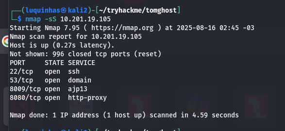
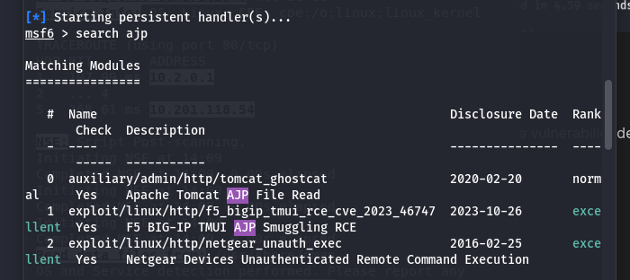
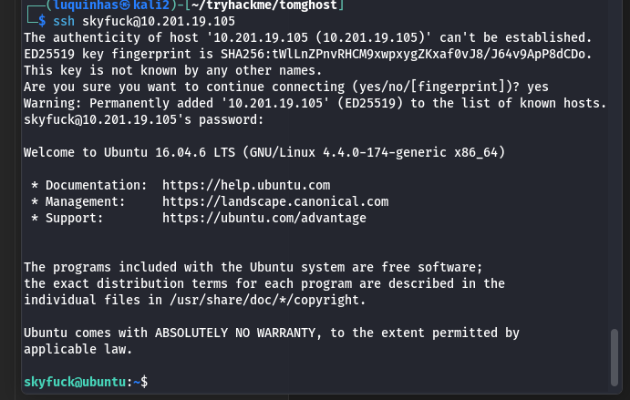
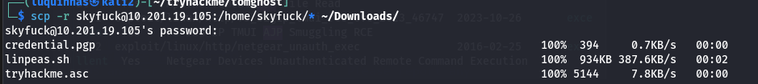
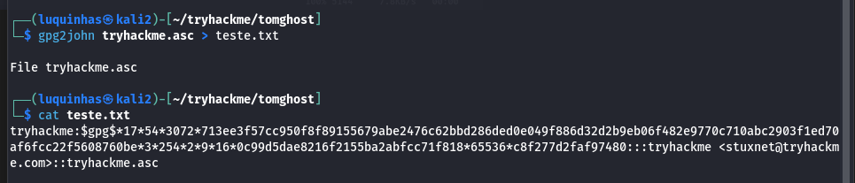
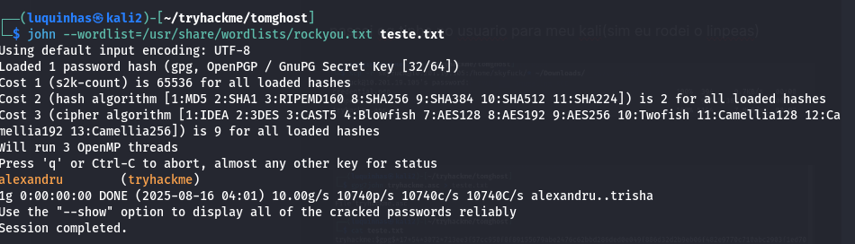
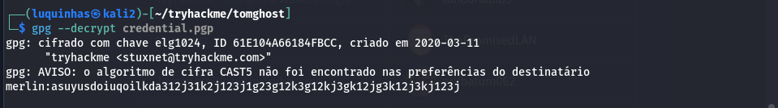
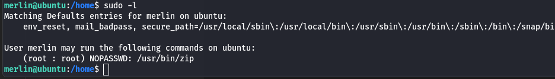
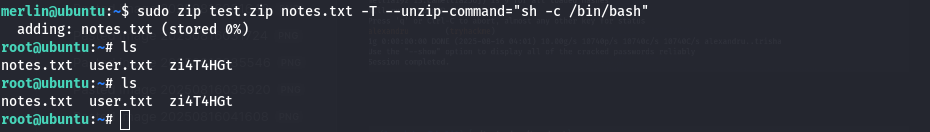

# Writeup – Tomghost (TryHackMe)

## Nmap
Primeiro realizei um scan de portas com o `nmap` para identificar os serviços expostos na máquina:

O scan retornou as portas:
- **22/ssh**
- **53/tcp**
- **8009/tcp (ajp13)**
- **8080/tcp (http-proxy)**

---

## Vulnerabilidade AJP13 (Ghostcat)
Pesquisando sobre o serviço **ajp13**, encontrei a vulnerabilidade **Ghostcat (CVE-2020-1938)**, que afeta versões do Apache Tomcat abaixo da 9.31.  
Com o `metasploit` verifiquei que havia módulo para exploração:

Consegui explorar a vulnerabilidade e extrair o arquivo `WEB-INF/web.xml_471249.txt`, que continha credenciais.

---

## Acesso via SSH
No arquivo extraído, estavam as credenciais:  

skyfuck:8730281lkjlkjdqlksalks

Testei o login via SSH e obtive acesso:

Encontrei o usuário **merlin** e consegui a **primeira flag (user.txt)**:

---

## Escalada de privilégios
Copiei os arquivos do usuário para minha máquina Kali usando `scp`, incluindo um arquivo `tryhackme.asc`.  

Utilizando `gpg2john` + `john` consegui quebrar a senha da chave GPG.  
Após isso, descriptografei o arquivo e recuperei novas credenciais para o usuário **merlin**.

---

## Root
Ao verificar permissões de `sudo`, vi que o usuário **merlin** podia rodar o `zip` como root sem senha.  

Usei o binário do `zip` para escalar privilégios e abrir um shell root:

E com isso, consegui a **flag root** 🎉
