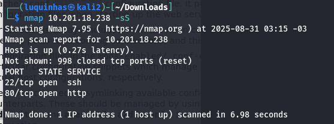
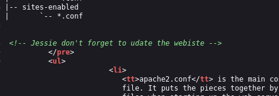
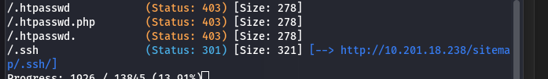
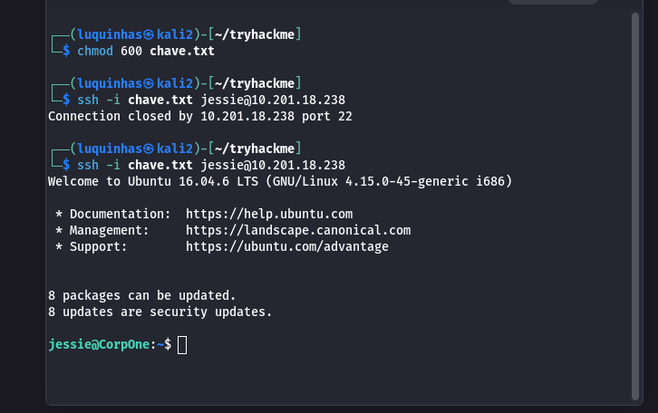
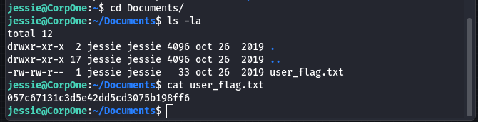
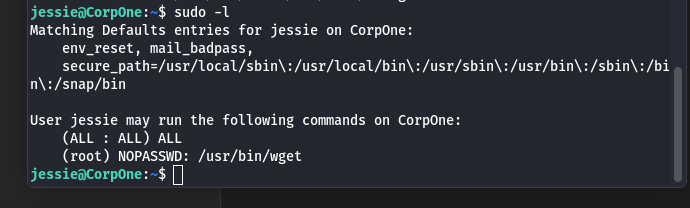
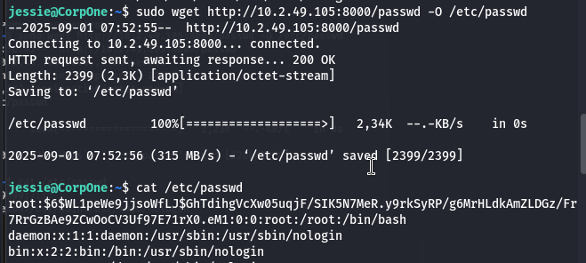
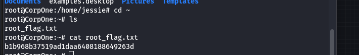

## Enumeração inicial

Comecei com um scan de portas usando **Nmap** e identifiquei que os serviços abertos eram:

    

## Reconhecimento Web

Acesseando a porta 80, explorei o código-fonte da página e encontrei um usuário  mencionado.

Utilizando **Gobuster** para força bruta de diretórios, identifiquei a rota:

Rodando novamente o Gobuster dentro dessa rota, encontrei:

    
Dentro dele, havia uma **chave privada SSH**:

## Acesso inicial

Baixei a chave e ajustei as permissões:

O login foi bem-sucedido com o usuário `jessie`.  

No diretório `/documents`, encontrei a **user_flag.txt**:

## Escalada de privilégios

Listando permissões com `sudo -l`, descobri que era possível executar o **wget** como root sem senha:

Criei um arquivo `passwd` modificado, inserindo no campo `root` uma senha com hash gerada previamente.

Iniciei um servidor Python local e forcei o download como root:

Com isso, sobrescrevi o arquivo de senhas do sistema.

## Root access

Agora foi possível logar como root diretamente.

Utilizando a senha que defini, obtive acesso root e localizei a **root_flag.txt**:

